## 1 User cases
### 1.1 User case 1 - Home page showing all images or image by id
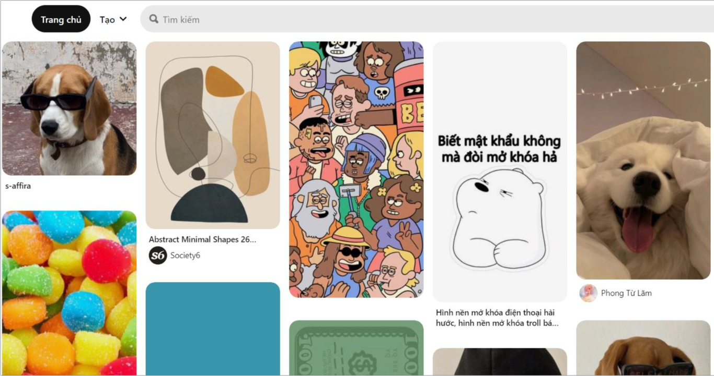

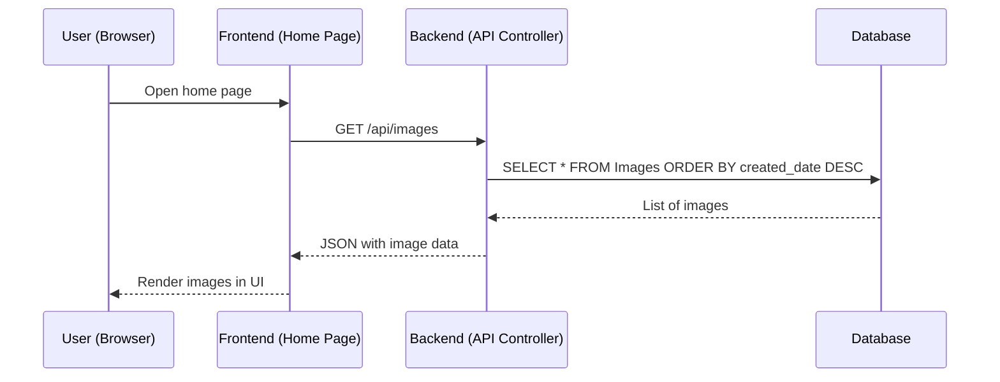
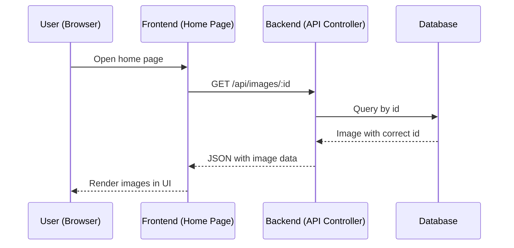
### 1.2 User case 2 - Details of an image
#### 1.2.1 Get image information
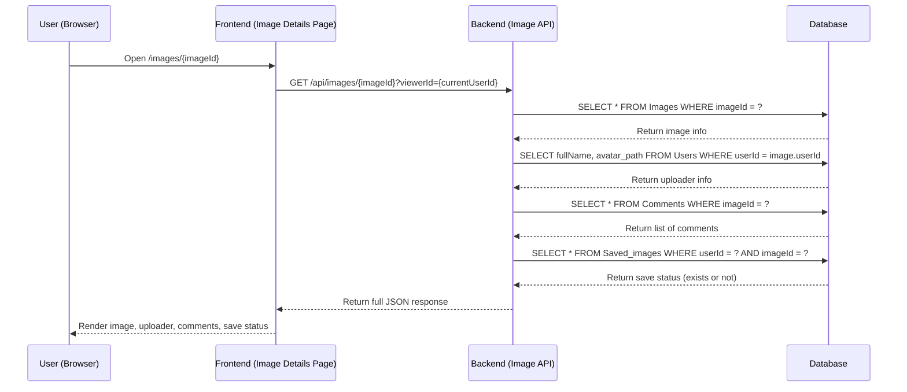

### 1.2.2 Comment to an image
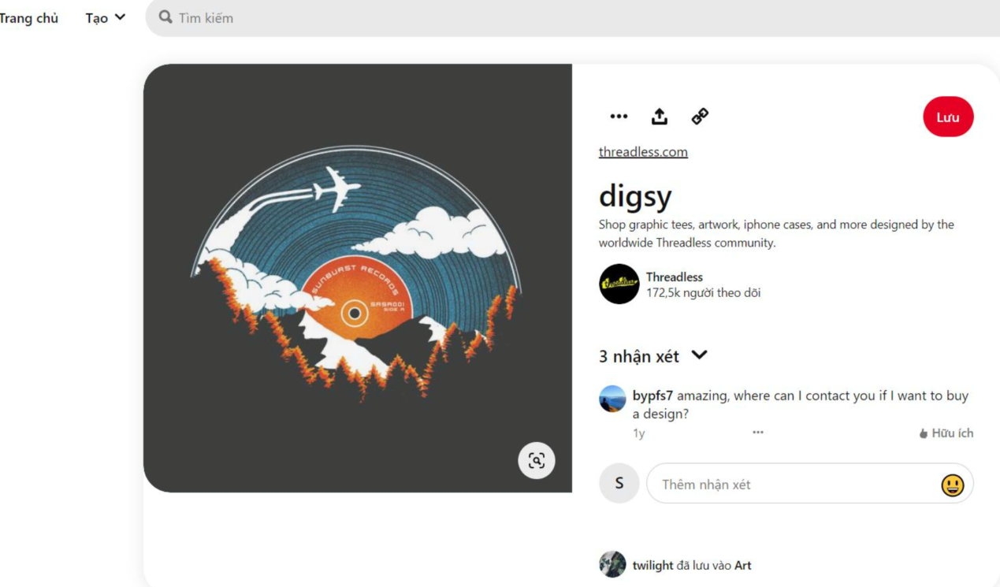

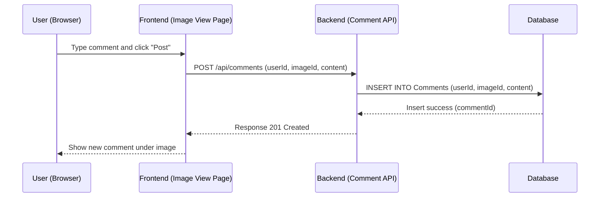

### 1.3 User case 3 - Personal profile
#### 1.3.1 Edit personal profile
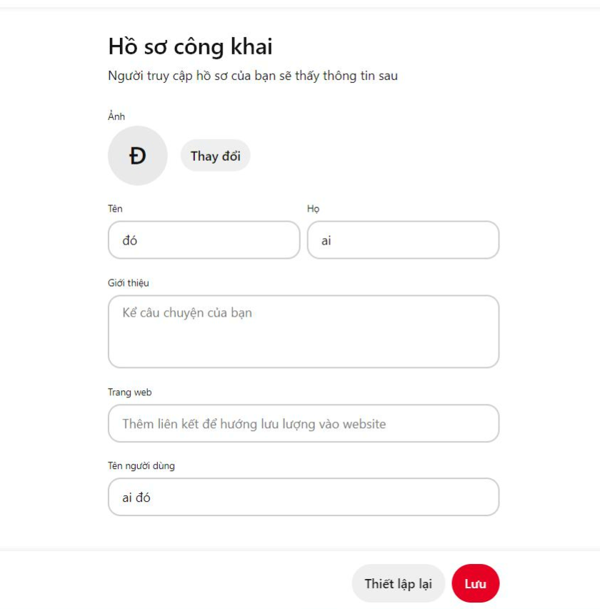

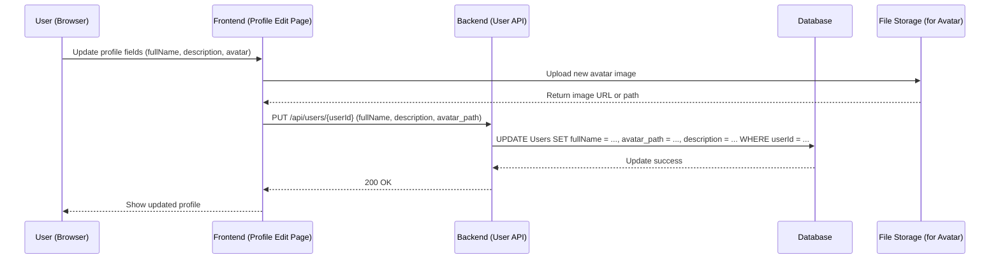
#### 1.3.2 View personal profile
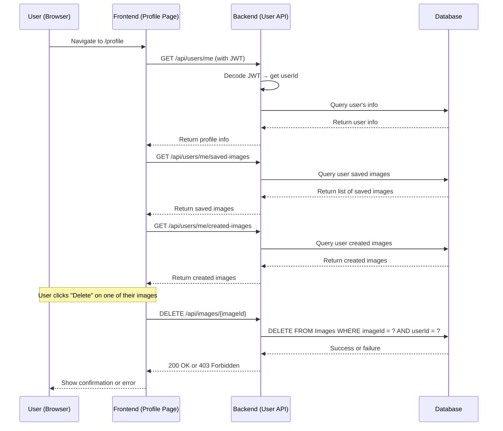

### 1.4 User case 4 - view other profile
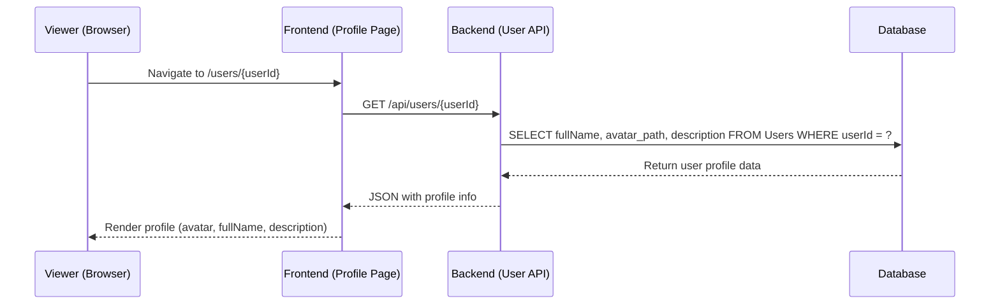

## 2 Authentication
### 2.1 Sign up
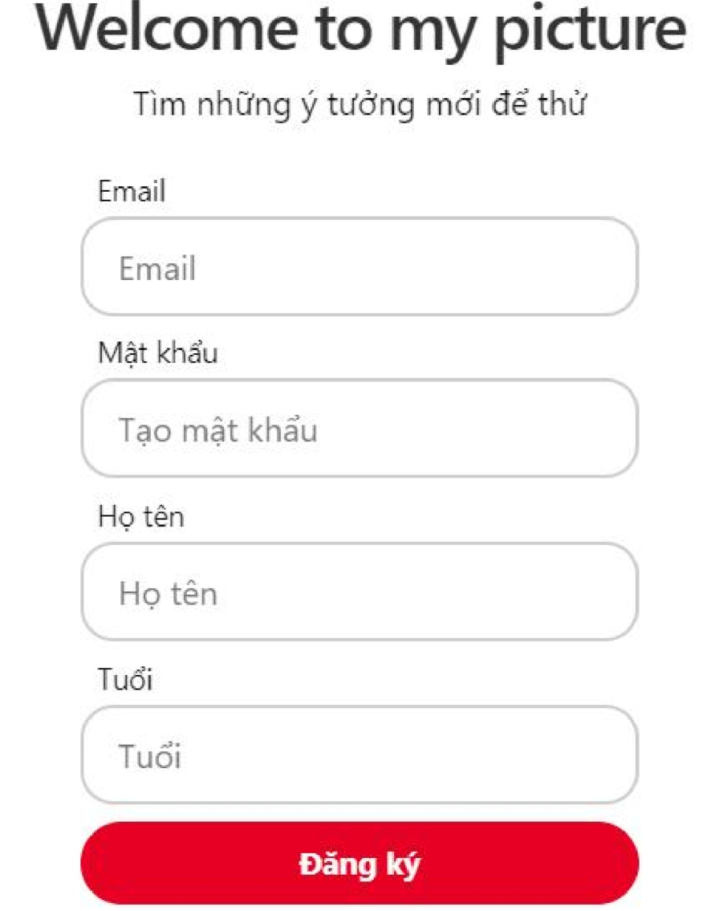

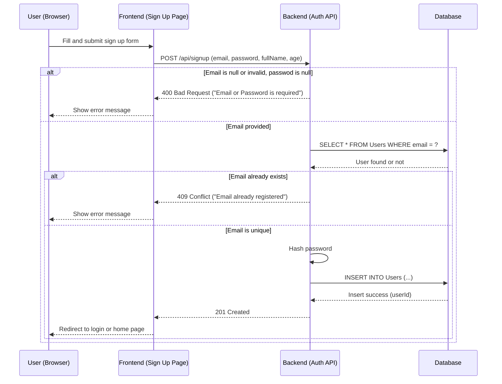

### 2.2 Sign in
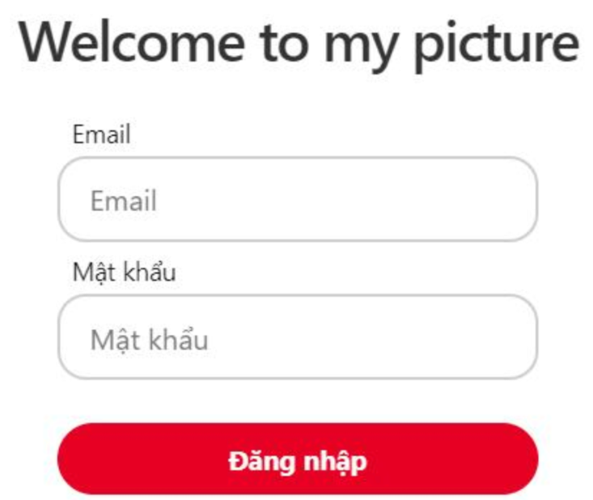

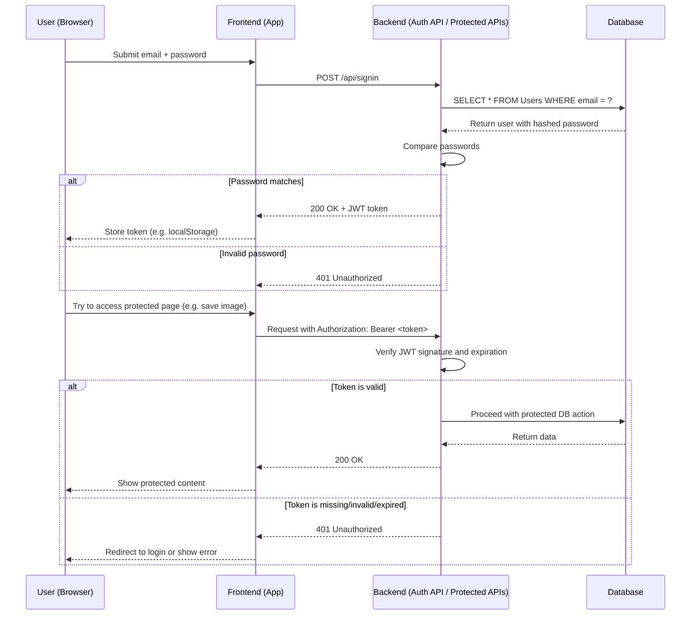